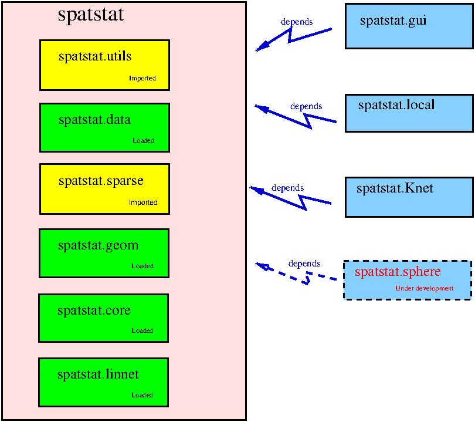

# spatstat (transitional, 'umbrella' package)

The original `spatstat` package has now been divided into a family of packages.

The package in this repository
contains almost no code from the original `spatstat` package.
It contains only the documentation, vignettes, and introductory
code for beginners. We call it an umbrella package because when you 
install and load this package, the other members of the family will
also be installed and loaded.

## The new structure of the 'spatstat' family

The `spatstat` package in this repository is represented by the pink box
in the diagram below. The yellow and green boxes are other sub-packages,
and the blue boxes are extension packages.

## Rollout of new packages

The new sub-packages `spatstat.xxx` have all been published on CRAN
with version numbers beginning with 1.

The umbrella `spatstat` has now been published (13 march 2021) with
version number `2.0-1`.

The sub-packages must now be updated to version numbers beginning with 2.
Each submission step requires that the previous submissions have been
accepted and propagated across the CRAN network.

1. `spatstat.utils 2.1-0` is now on CRAN.

2. `spatstat.sparse 2.0-0` is now on CRAN.

3. `spatstat.linnet 2.0-0` is now on CRAN.

4. `spatstat.geom 2.0-1` is now on CRAN.

5. `spatstat.core 2.0-0` is now on CRAN.

6. `spatstat.linnet 2.1-0`.
Estimated submission date: 27 March 2021.
Available now at the GitHub repository
[baddstats/spatstat.linnet](https://github.com/baddstats/spatstat.linnet).

